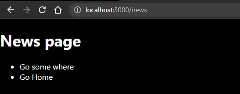

# simple next app

> #### A web application for a covid statas.

## Built With

- nextJS

## Getting Started

To get a local copy up and running follow these simple example steps.

`git clone https://github.com/eng-mohamed-eldeeb/simpleNextJSAPP.git `

Then `cd simpleNextJSAPP`

Then `npm install` to install packages

Finally `npm run dev`

## Authors

👤 **Mohamed Eldeeb**

- GitHub: [@eng-mohamed-eldeeb](https://github.com/eng-mohamed-eldeeb)
- LinkedIn: [LinkedIn](https://www.linkedin.com/in/mohamed-eldeeb-a69022206/)

## Site Screenshots

## Show your support

Give a ⭐️ if you like this project!
